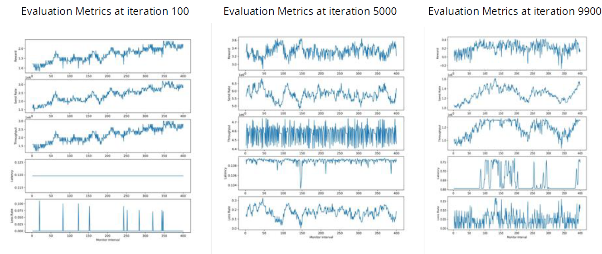

# University of Pittsburgh INFSCI 2440 Artificial Intelligence Spring 2023 Final Project
## Optimal Routing of Packets Using RL

### Environment
The agent is the transmitter of traffic in our concept, and its activities lead to changes in sending rates.
We use the concept of monitor intervals (MIs) to define this.
Time is split into segments that are successive. 
The sender can alter its transmission rate xt at the start of each MI t, which remains constant during the MI.

### Sample Run

1.  In the above video we are trying to send packets from the senders (orange nodes) to the target (blue nodes), via two routers.
2.  When the routers are full, they change color to red and otherwise if the queue has space the color is green.
3.  The policy dictates packets of which sender are to be prioritized since every sender has a different throughput and senders which send data more frequently should be prioritized to minimize loss of packets.

### Results

The Graphs tell us about the different evaluation metrics at Iteration 100,5000 and 9900.
The progress of the latency metric can help us understand the evaluation.
1.  Iteration 100 -We can observe that the latency is quite low and consistent.Because the model is still in its early stages, the routers haven't had a chance to populate the queues. This permits the packets to be transmitted without interruption.
2.  Iteration 5000 -In this case , the routers had time to add packets to the queues but the model is not completely trained. Hence, we observe a high latency as the policy is not optimal.
3.  Iteration 9900 -Now, although the routers are filling up their queues frequently but the model has had ample time to train. This provides an optimal policy which results in low latency.

Hence the Iteration 9900 is the most representative of real world scenario and the policy we obtained at that Iteration is the optimal one as it started to keep the latency low.

### Overview
This repo contains the gym environment required for training reinforcement
learning models for created policies that govern packet routing over a network with 2 routers and multiple senders

### Training
To run training only, go to ./src/gym/, install any missing requirements for
stable\_solve.py and run that script.

### Results

